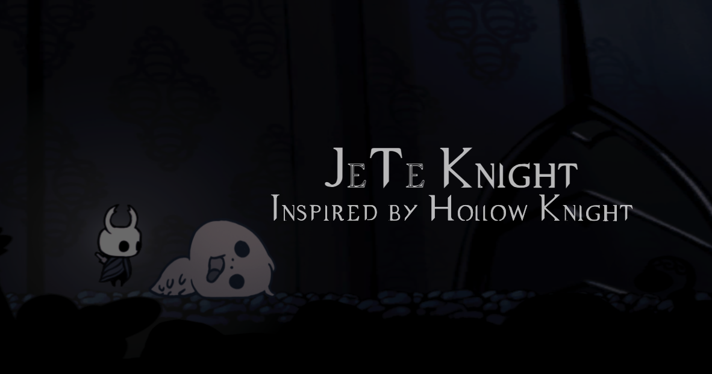

# Hollow Knight JavaScript Game

A web-based implementation of Hollow Knight built with vanilla JavaScript, HTML5 Canvas, and modern web technologies. This project recreates the atmospheric 2D platformer experience in the browser.

**Project Initiated: 2022** | **Created WITHOUT the use of any Artificial Intelligence**



## 🎮 Game Overview

This is a browser-based adaptation of the beloved indie game Hollow Knight. Players control the enigmatic Knight as they explore a vast, ancient kingdom beneath the fading town of Dirtmouth. The game features platforming mechanics, combat systems, boss battles, and atmospheric audio-visual design.

## ✨ Features

### Core Gameplay
- **2D Platformer Mechanics**: Jump, dash, and navigate through challenging environments
- **Combat System**: Attack enemies with your nail, use special abilities like blast attacks
- **Boss Battles**: Face off against formidable foes like the False Knight
- **Enemy AI**: Fight against Crawlids, Booflies, and other creatures
- **Health System**: Manage your health with a visual health bar
- **Currency System**: Collect geo (money) from defeated enemies

### Technical Features
- **HTML5 Canvas Rendering**: Smooth 60fps gameplay
- **Sprite Animation**: Detailed character and enemy animations
- **Audio System**: Immersive sound effects and background music
- **Camera System**: Dynamic camera following with screen shake effects
- **Particle Effects**: Visual feedback for attacks and environmental effects
- **Pause System**: Full game pause with options menu
- **Fullscreen Mode**: Immersive fullscreen gameplay experience

### UI/UX Features
- **Responsive Design**: Works across different screen sizes
- **Landing Page**: Beautiful promotional website with game information
- **Interactive Elements**: Animated menus and transitions
- **Settings Menu**: Volume control and FPS display options

## 🚀 Getting Started

### Prerequisites
- A modern web browser (Chrome, Firefox, Safari, Edge)
- A local web server (for asset loading)

### Installation

1. **Clone the repository**
   ```bash
   git clone https://github.com/yourusername/hollow-knight-js.git
   cd hollow-knight-js
   ```

2. **Start a local server**
   
   Using Python:
   ```bash
   # Python 3
   python -m http.server 8000
   
   # Python 2
   python -m SimpleHTTPServer 8000
   ```
   
   Using Node.js:
   ```bash
   npx http-server
   ```
   
   Using PHP:
   ```bash
   php -S localhost:8000
   ```

3. **Open in browser**
   Navigate to `http://localhost:8000` in your web browser

## 🎯 How to Play

### Controls
- **Arrow Keys / WASD**: Move left/right
- **Space / W / Up Arrow**: Jump
- **X**: Attack with nail
- **C**: Dash
- **Z**: Blast attack
- **Escape**: Pause game
- **F**: Toggle fullscreen
- **Enter**: Start game

### Gameplay Tips
- Defeat enemies to collect geo (money)
- Use platforms to reach higher areas
- Watch your health - you have 5 hearts
- Find the boss door by defeating enough enemies
- Use dash to avoid attacks and reach distant platforms
- Rest at benches to recover health

## 🏗️ Project Structure

```
hollow-knight-js/
├── assets/                 # Game assets
│   ├── game/              # In-game sprites and audio
│   │   ├── audio/         # Sound effects and music
│   │   ├── hero/          # Player character sprites
│   │   ├── boss/          # Boss enemy sprites
│   │   ├── enemies/       # Enemy sprites (crawlid, boofly)
│   │   └── ui/            # User interface elements
│   ├── landing/           # Landing page assets
│   └── font/              # Custom fonts
├── css/                   # Stylesheets
│   ├── game.css          # Game-specific styles
│   ├── landing.css       # Landing page styles
│   └── style.css         # Base styles
├── js/                    # JavaScript modules
│   ├── game/             # Core game logic
│   │   ├── model/        # Game object classes
│   │   ├── facade/       # Utility modules
│   │   └── parent/       # Base classes
│   ├── system/           # System modules
│   └── landing.js        # Landing page functionality
├── index.html            # Landing page
├── game.html             # Game page
└── auth.html             # Authentication page
```

## 🛠️ Technical Architecture

### Core Systems
- **Game Engine**: Custom JavaScript game engine with entity-component architecture
- **Rendering**: HTML5 Canvas with sprite-based graphics
- **Physics**: Custom collision detection and gravity system
- **Audio**: Web Audio API integration with volume controls
- **Animation**: Frame-based sprite animation system

### Key Classes
- `GAME`: Main game controller and state management
- `Player`: Player character with movement and combat abilities
- `Boss`: Boss enemy with complex AI patterns
- `Crawlid/Boofly`: Enemy classes with different behaviors
- `Camera`: Dynamic camera system with smooth following
- `UI`: User interface management
- `Audio`: Audio system with background music and sound effects

## 🎨 Assets

The game includes:
- **Character Sprites**: Detailed animations for player, enemies, and bosses
- **Environment Art**: Backgrounds, platforms, and environmental objects
- **Audio**: High-quality sound effects and atmospheric music
- **UI Elements**: Health bars, currency display, and menu graphics

## 🔧 Development

### Adding New Features
1. Create new model classes in `js/game/model/`
2. Extend base classes from `js/game/parent/`
3. Register new objects in the main game loop
4. Add corresponding sprites to the assets folder

### Performance Optimization
- Sprite caching for improved performance
- Efficient collision detection algorithms
- Optimized rendering pipeline
- Audio preloading and management

## 🐛 Known Issues

- Some audio files may not load in certain browsers
- Performance may vary on older devices
- Fullscreen mode requires user interaction to activate

## 🤝 Contributing

Contributions are welcome! Please feel free to submit pull requests or open issues for bugs and feature requests.

### Development Guidelines
- Follow existing code style and structure
- Test changes across different browsers
- Ensure assets are properly optimized
- Document new features and changes

## 📄 License

This project is inspired by Hollow Knight by Team Cherry. This is a fan-made recreation for educational purposes.

## 🙏 Acknowledgments

- **Team Cherry**: Original creators of Hollow Knight
- **Christopher Larkin**: Composer of the original soundtrack

## 📞 Contact

Created by TinTin Winata as part of Web Design NAR 23-1 project.

**Important Note**: This project was initiated in 2022 and developed entirely without the use of any artificial intelligence tools or assistance. All code, game logic, and implementation was created through traditional programming methods and human creativity.

---

*"Alongside Courage And Perseverance We Shape and Define Our Future"* - JT 22-1

**JeTe Knight** - Inspired by Hollow Knight
